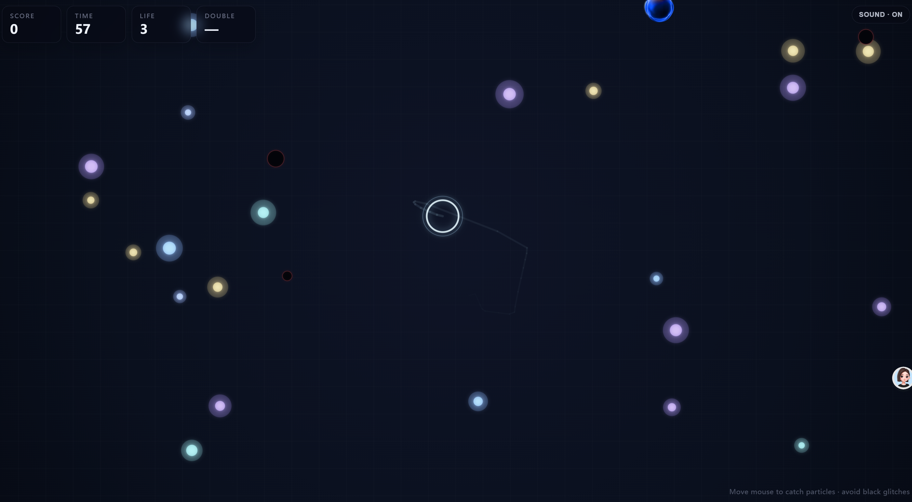

# 流光鼠标

- 学员昵称：LM
- GitHub 用户名：LM-X1122
- 课次：第一课（lesson-01）
- 完成状态：已完成（作者自述）
- 在线体验：无，请下载后本地打开
- 项目仓库：https://github.com/LM-X1122/code2art_class_vibecoding

## 作品介绍
移动鼠标或拖动手指控制圆环，收集漂浮的粒子，在 60 秒内争取更高分数。作品页面内名称为「秩序捕手」，收集过程会生成对称纹样，并提供声音反馈。

## 本次完成
- 圆环跟随鼠标或触摸位置，收集粒子并计分。
- 60 秒倒计时、生命值、连击与金色粒子双倍得分。
- 收集和碰撞声音反馈，可通过右上角按钮开关声音。
- 游戏结束后展示分数、最高连击、收集数量和生成的纹样。

## 如何运行
1. 下载本目录的 `index.html`，用支持 Canvas 2D 和 Web Audio 的现代浏览器打开，无需安装依赖或联网。
2. 点击「开始游戏」，移动鼠标或拖动手指，让圆环接触光点。
3. 避开黑色粒子；时间结束或生命值耗尽后查看结果，点击「再玩一次」重新开始。

## 当前问题
暂无已知问题（作者反馈）。已通过 JavaScript 语法检查；本次提交准备尚未完成浏览器运行验证。

## 创作记录
- 使用工具：原生 HTML、CSS、JavaScript；Codex 协助整理提交材料。
- 本次主要实现：圆环收集粒子，加入倒计时和声音反馈。
- 素材来源与许可：图形由 Canvas 程序绘制，声音由 Web Audio 合成；代码未引用外部图片、音频或字体文件。

## 作品截图

## 展示意愿
- 可用于课程宣传：是
- 署名：LM
