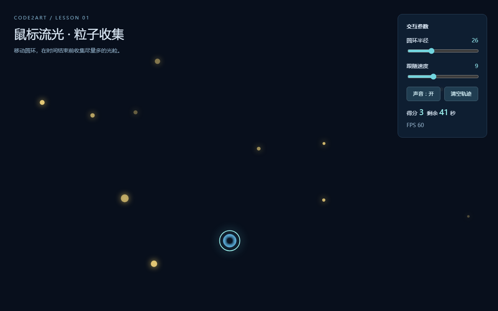

# 鼠标流光 · 粒子收集

- 学员昵称：ZijieYao
- GitHub 用户名：ZijieYao001
- 课次：第一课
- 完成状态：已完成
- 在线体验：无，请下载后本地打开
- 项目仓库：本目录（单文件作品）

## 作品介绍

移动鼠标控制发光圆环，触碰画面中随机出现的金色光粒即可收集，每次收集伴随提示音和爆闪光效。倒计时 60 秒，时间到弹出得分结算，可一键再来一局。

## 本次完成

- 鼠标与触摸控制圆环平滑跟随，保留流动拖尾。
- 光粒随机生成并随时间淡出，圆环触碰即收集得分。
- 60 秒倒计时，最后 10 秒数字变暖色提醒，结束弹出结算并可重开。
- 收集、开局、结算三种音效，全部由 WebAudio 实时合成，无外部素材。
- 圆环半径、跟随速度两个可调参数；提供声音开关、清空轨迹按钮和 FPS 显示。
- 单 HTML 文件、零依赖、不需要联网。

## 如何运行

1. 下载本目录中的 `index.html`。
2. 用支持 Canvas 2D 的现代浏览器（Chrome / Edge / Firefox）打开。
3. 点击「开始游戏」，移动鼠标或拖动手指收集光粒。
4. GitHub 文件页面只显示源码，不能直接在那里体验交互。

## 当前问题

暂无已知问题。

## 创作记录

- 使用工具：AI 辅助编写原生 HTML、CSS、JavaScript（WorkBuddy）。
- 我的主要修改或判断：在课程示例「流光跟随」的基础上加入收集目标与倒计时，把交互演示改造成有小目标的小游戏；音效采用 WebAudio 现场合成，保持单文件零素材。
- 素材来源与许可：图形与声音均由程序实时生成，没有外部图片、字体或音频素材。

## 作品截图

## 展示意愿

- 可用于课程宣传：是
- 署名：ZijieYao
