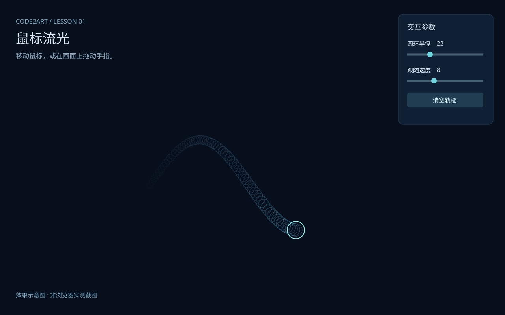

# 鼠标流光｜第一课提交示例

> 这是用于演示提交格式的教学样例，不是真实学员作业。请在自己的用户名目录提交作品。

- 学员昵称：Contra
- GitHub 用户名：avantcontra
- 课次：第一课
- 完成状态：已完成基础交互
- 在线体验：无，请下载后本地打开
- 项目仓库：本目录

## 作品介绍

移动鼠标，圆环平滑跟随，身后留下一段逐渐消失的轨迹。
右侧面板可以调整圆环半径和跟随速度。手机或触屏设备上可拖动手指体验。

## 本次完成

- 鼠标与触摸控制圆环。
- 平滑跟随与逐渐消失的拖尾。
- 半径与跟随速度两个可调参数。
- 显示帧率，提供清空轨迹按钮。
- 单 HTML、无外部依赖，不需要摄像头或联网。

## 如何运行

1. 下载本目录中的 `index.html`。
2. 用支持 Canvas 2D 的现代浏览器打开。
3. 在画布区域移动鼠标或拖动手指。
4. 调整面板滑块，观察变化。

GitHub 文件页面只显示源码，不能直接在那里体验交互。

## 当前问题

- 尚未提供轨迹导出。
- 帧率随设备和窗口尺寸变化；本样例不承诺所有设备固定60帧。

## 创作记录

- 使用工具：AI 辅助编写原生 HTML、CSS、JavaScript。
- 主要判断：保留短拖尾和两个基础参数，便于观察跟随速度对画面的影响。
- 素材来源与许可：图形由程序绘制，没有外部图片、字体或音频素材。

## 效果示意

本图用于展示作业配图格式，不是浏览器实测截图。学员提交时请替换为自己作品的真实截图。

## 验证记录

本示例已检查 JavaScript 语法及文档链接。当前制作环境未完成浏览器运行验证，请下载后打开体验。

## 展示意愿

- 可用于课程宣传：否
- 署名：教学示例

此字段仅演示填写格式，不代表收集到了任何真实学员授权。
