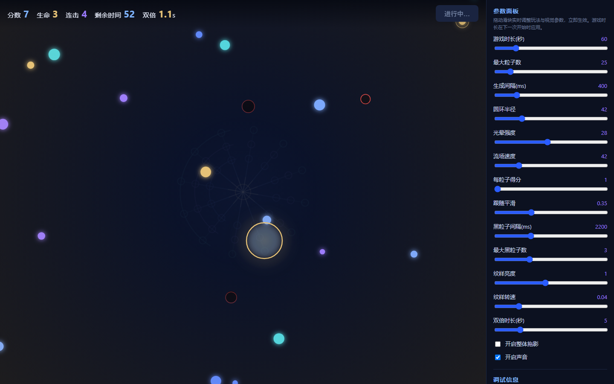

# 秩序捕手

- 学员昵称：Botian
- GitHub 用户名：botyzhang-lab
- 课次：第一课（lesson-01）
- 完成状态：已完成基础玩法
- 在线体验：无，需下载后本地打开
- 项目仓库：本目录

## 作品介绍

移动鼠标或拖动手指，用圆环去捕捉画布上漂浮的光点；收集到的光点会逐渐把失序的粒子重新组织成纹样。一局限时 60 秒，左上角显示分数、生命、连击与剩余时间，画面右侧的参数面板可以实时调整玩法与视觉参数。

## 本次完成

- 圆环跟随鼠标／触摸，进入半径范围即收集粒子。
- 倒计时与计分：右上角显示剩余时间，收集粒子累计得分，并带连击倍率。
- 声音反馈：收集、连击等事件通过 Web Audio API 纯合成提示音，无外部音频文件。
- 参数面板：游戏时长、最大粒子数、生成间隔、圆环半径、光晕强度、流场速度、跟随平滑等可实时调整。
- 单文件 `index.html`，无外部依赖，不需要联网或摄像头。

## 如何运行

1. 下载本目录中的 `index.html`。
2. 用支持 Canvas 2D 的现代浏览器（Chrome / Edge 等）直接打开。
3. 点击画面中央的「开始游戏」。
4. 在画布区域移动鼠标或拖动手指收集光点；右侧面板可拖动滑块改变参数（游戏时长在下一次开始时生效）。
5. 声音需要浏览器允许播放，若没有声音请检查是否处于静音或未允许音频播放。

GitHub 的文件页面只显示源码，无法直接在线体验交互。

## 当前问题

- 纹样图案每次都一样，还不会根据收集结果变化。

## 创作记录

- 使用工具：AI 辅助编写原生 HTML / CSS / JavaScript，单文件实现。
- 我的主要判断：保留「圆环捕捉 + 倒计时 + 声音反馈」这条核心循环，其余视觉与玩法参数尽量暴露到面板上，方便边调边看效果。
- 素材来源与许可：没有外部图片、字体或音频素材，图形由代码绘制，声音由 Web Audio API 合成。

## 作品截图

截图为 Chrome 中实际运行的画面。

## 展示意愿

- 可用于课程宣传：否
- 署名：Botian
